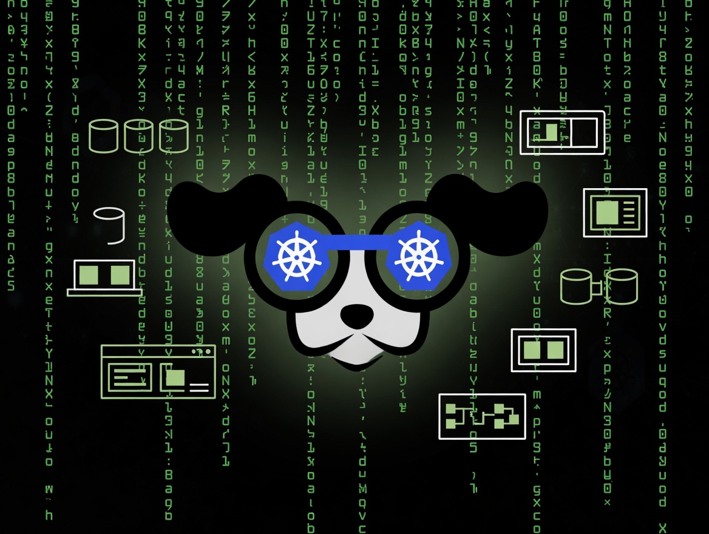

# k9s

A powerful terminal UI for Kubernetes that makes managing clusters feel fast, intuitive, and actually enjoyable.

k9s is a terminal-based UI (think vim meets kubectl on steroids) that gives you
real-time visibility and control over your Kubernetes clusters. It continuously
watches your resources and lets you navigate, inspect, debug, and manage
everything with keyboard shortcuts instead of typing endless `kubectl` commands.

## When Should You Use It?

If you live in Kubernetes (and who doesn't these days), k9s will quickly become
one of your most-used tools. Once your `kubeconfig` is set, you just run `k9s`
and you're dropped into a live, searchable, real-time view of your pods,
deployments, services, nodes — you name it.

Switch namespaces with `:ns`, drill into logs with `l`, exec into containers,
port-forward with a few keystrokes, scale deployments, edit resources in your
`$EDITOR`, and even run Popeye (the built-in linter) to catch misconfigurations.
Everything updates live. No more switching between multiple `kubectl get/watch`
terminals or fighting with JSON output.

It's especially great for:

- Daily operations and troubleshooting
- Multi-cluster / multi-namespace work
- When you need speed and don't want to leave the terminal

## When It Doesn't Make Sense?

k9s is fantastic for interactive work, but it's not a replacement for
everything. For production monitoring dashboards, alerting, or long-term
historical metrics, you'll still want Prometheus + Grafana or your observability
stack.

If you're doing one-off automation or CI/CD pipelines, stick with plain
`kubectl`, `helm`, or Terraform. k9s is an interactive tool — not something
you'd script against. Beginners who are still learning Kubernetes concepts might
find the dense UI overwhelming at first (though the help screen `:help` is
excellent).

---

## Conclusion

k9s is one of those tools that makes you noticeably faster the moment you start
using it. After 20+ years in the industry, I can say it genuinely improves
quality of life when working with Kubernetes. Once you get muscle memory for the
shortcuts, going back to raw `kubectl` feels painfully slow.

If you run K8s at any scale, install this today. You’ll thank yourself the next
time you’re debugging a flaky pod at 2 AM.

