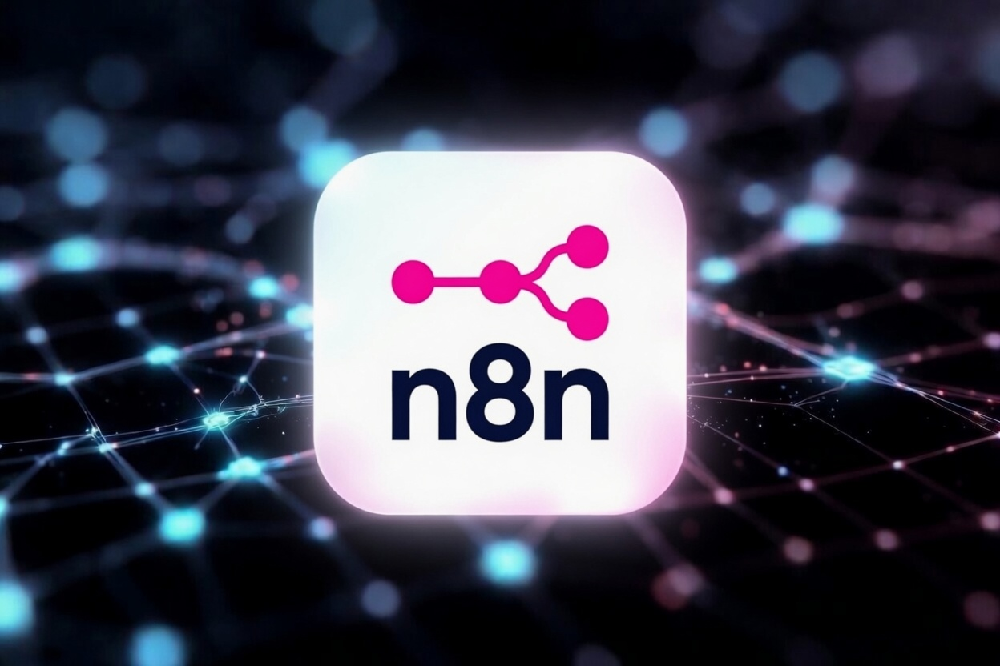

# n8n

The best visual workflow automation editor that connects to almost everything.

n8n is a fair-code licensed, node-based workflow automation tool that lets you
connect apps, APIs, databases, and AI models with a visual canvas — while giving
you the full power of JavaScript or Python when you need it.

## When Should You Use It?

If you're tired of paying per task for Zapier or Make, or if you need to keep
sensitive data in-house, n8n is fantastic. It shines for technical teams who
want the speed of a visual builder without giving up control.

You build workflows by dragging nodes (triggers, actions, logic, code) and
connecting them. There are 400+ native integrations, plus an HTTP Request node
that can talk to literally anything. Throw in native AI Agent nodes with memory
and tools, and you can build surprisingly sophisticated automations — from
simple Slack notifications to full multi-step AI pipelines that reason over your
own data.

Self-hosting is straightforward (Docker one-liner), scaling works with queue
mode + workers, and everything stays under your roof. Once you get the hang of
it, you start automating all the repetitive glue work across your stack and
actually ship faster.

## When It Doesn't Make Sense?

n8n is incredibly flexible, but that flexibility comes with a learning curve. If
you're a non-technical user looking for dead-simple "if-this-then-that" with
beautiful polished UI and zero maintenance, something like Zapier will feel
easier out of the box.

It also isn't magic for extremely high-volume enterprise use cases without
proper infrastructure investment (though many teams run it at serious scale).
Complex file handling or long-running heavy processing can sometimes feel clunky
compared to writing a dedicated service. And while the community is strong, you
won't get enterprise-grade hand-holding support unless you pay for it.

---

## Conclusion

n8n has become one of my go-to tools for anything that needs to move data or
trigger actions between systems. The combination of visual building + real
code + self-hosting + native AI capabilities is hard to beat, especially at the
price (free when self-hosted).

It’s one of those rare tools that feels like it was built by and for actual
engineers. Highly recommended if you value ownership and flexibility.

