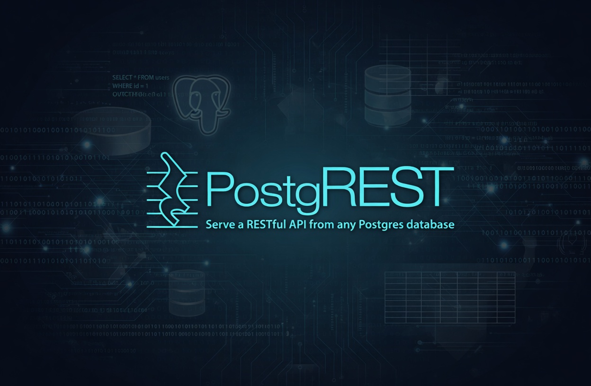

# PostgREST

Automagically generate a production-ready REST APIs from any PostgreSQL database.

PostgREST connects to your existing PostgreSQL database and, based on your
schema and permissions, automatically creates and serves a powerful (filtering,
sorting, pagination, etc.), extremely performant, and production-ready REST API
written in Haskell.

## When Should You Use It?

Many modern projects consist of two parts: a user interface that runs on the
**client** (browser, mobile app, terminal, etc.) and an API that runs on the
**server**. In short, the client interacts with the user, while the server
interacts with the database.

Using PostgREST is like cheating — you get half the project done instantly. Once
your PostgreSQL database and tables are ready, you just install and configure
PostgREST to connect to it, and you instantly have a fully-featured REST API up
and running.

## When It Doesn't Make Sense?

PostgREST works great for CRUD operations, but it’s not the best choice if your
project involves complex business logic or workflows, such as:

- External API calls
- Payments
- Sending emails

You can work around this using various PostgreSQL extensions for HTTP requests,
job scheduling, etc., but at some point this added complexity defeats the main
benefits of the tool.

---

## Conclusion

This is a tool I always consider adding to my new projects. When you think about
the huge number of LLM tokens it saves by not having to write your own REST API…
it’s insane!

