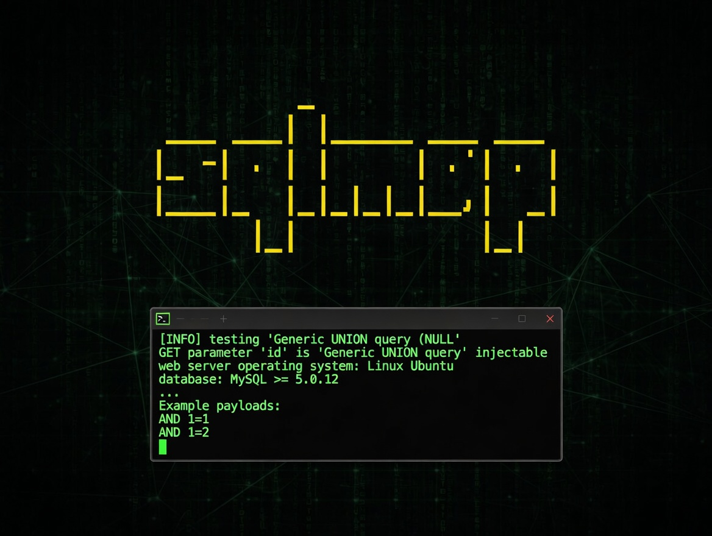

# sqlmap

Automatic SQL injection and database takeover tool.

**sqlmap** is an open-source penetration testing tool that automatically detects
and exploits SQL injection vulnerabilities in web applications, then helps you
take over the underlying database server.

## When Should You Use It?

Whenever you're doing security assessments, bug bounty hunting, or internal
pentests and you suspect (or need to confirm) SQL injection flaws.

Instead of manually crafting payloads for boolean-based blind, time-based blind,
error-based, UNION, or stacked queries, you point sqlmap at a vulnerable URL or
request file and let it do the heavy lifting. It will:

- Detect the injection point
- Fingerprint the database and version
- Enumerate databases, tables, columns, and users
- Dump the data you need
- Escalate privileges when possible

It's like having a tireless expert assistant that never gets bored testing
hundreds of payloads and techniques.

## When It Doesn't Make Sense?

sqlmap shines on straightforward or even complex SQLi vectors, but it has
limits:

- It won't find vulnerabilities that aren't there (obviously)
- Very custom or heavily obfuscated injection points sometimes need manual
  tweaking or tamper scripts
- It's noisy by nature — great for labs and authorized tests, but can easily
  trigger WAFs, IDS, or rate limits in real engagements
- For extremely delicate environments where you only want to prove existence
  without any data extraction, a lightweight manual check might be safer

Also, remember the golden rule: **only run it against systems you have explicit
permission to test**.

---

## Conclusion

This is one of the first tools I fire up during any web app security review. The
amount of time (and brain cycles) it saves when there's a real SQL injection is
ridiculous — it turns what could be hours or days of tedious manual work into
minutes. Always worth having in the toolkit.

