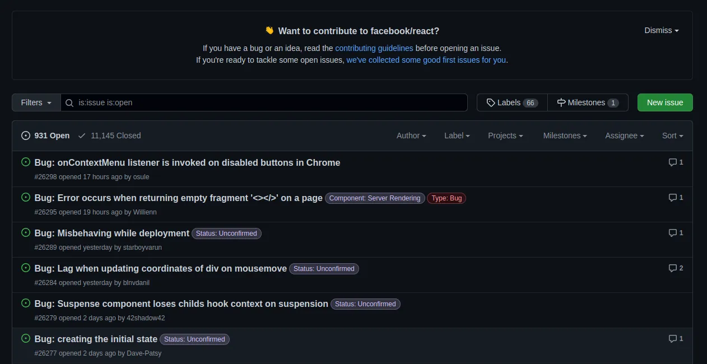
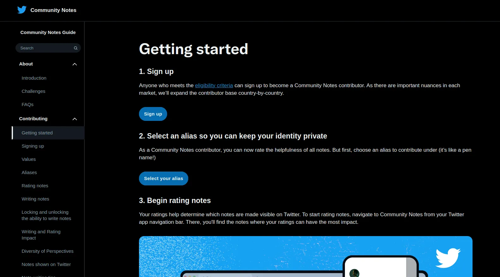
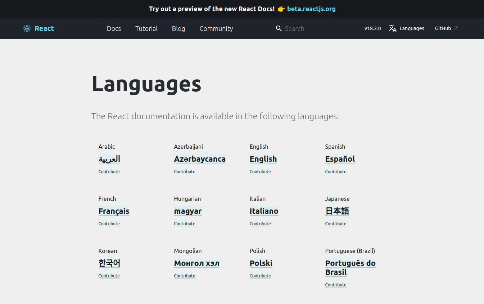
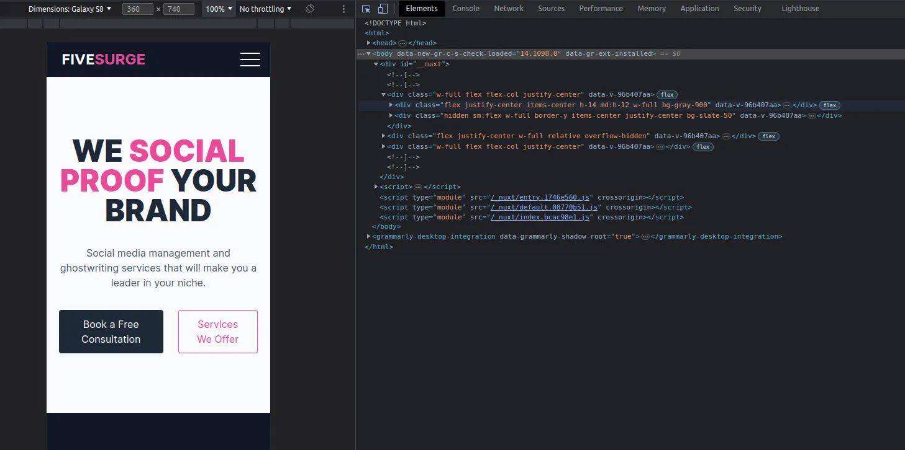
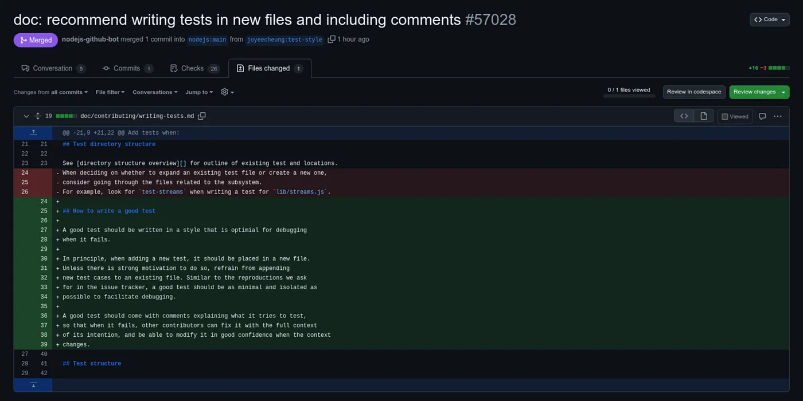

# 7 Ways You Can Contribute to Open-source Projects

There are several ways to contribute to open-source projects, even if you are not a developer.

Whether open-source or not, a project is much more than code. A successful
project requires code, documentation, visual artifacts, translations, planning,
management, etc.

A network of volunteers with a diversified skillset builds and maintains
open-source projects. Anyone can join the network and become a contributor, even
those less experienced.

No matter what you choose to do, your contribution is much appreciated by the
community. Here are the 7 ways you can contribute to open-source projects even
if you are not a developer:

## Report bugs and suggest improvements

Reporting bugs or suggesting new features to the project’s issue tracker is a
great way to contribute to open-source projects. This helps developers to
prioritize the issues and plan future improvements.

## Documentation

Good documentation is essential to the success of any project and it is one of
the easiest ways of contributing.

You can contribute by writing and editing the project’s documentation, user
manuals, tutorials, or API. It is also fine to fix minor typos as long as you
make sure that no one else is already fixing the same typo.

## Translation

Many open-source projects have users from all over the world. If you are fluent
in a language other than the project’s language, you can help translate the
project’s user interface, documentation, or website.

## Testing

Testing is a critical part of any software development project. You can help by
testing and reporting any bugs you find.

Even if you are not a professional tester you still can help by testing the
project on different OS, browsers, devices, etc.

## Code contributions

If you are a developer, you can contribute code to the project. You can start by
fixing minor bugs or implementing small features.

## Design

Open-source projects need good design as well. If you have skills in graphic
design or UI/UX, you can contribute by designing logos, icons, banners, or user
interfaces.

## Community management

Last but not least, you can help to manage the community by answering questions,
organizing events, onboarding new contributors, writing tutorials, or recording
videos.

---

## Conclusion

Remember that open-source projects thrive on collaboration and contributions
from the community. Whatever your skill set or level of experience, there are
always ways to contribute.

